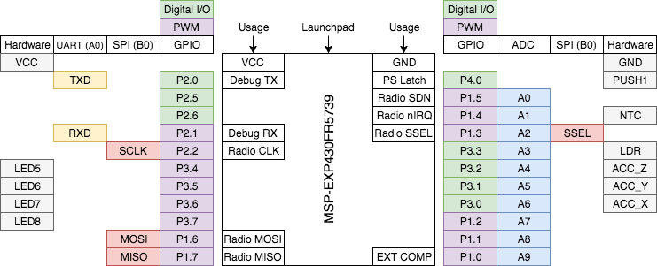

# pt3p-zeta

Library for radio module and part III project solution.

---

## The Project

The synopsis of my Part III individual project is networking in transient
systems. Take for example an end node of which is only powered by a transient -
that meaning it is intermittent and non-constant - supply such as a solar cell,
it would only be powering the device when there is light incident on the cell
(i.e. daytime). Any messages that are sent to this node when it is not powered
would therefore be lost.

My approach to solving this problem is to incorporate wake-up receiver (WuRx)
technology with low power operation and non-volatile memory.

## The Platform

### Micro-controller

The micro-controller of choice is the MSP430FR5739 from Texas Instruments. This
is due to its low power consumption and integrated non-volatile FRAM memory. The
intention for the final solution is that the received data will be stored in NVM
until the supply is sufficient to handle the data. Hence after a SPI transfer
from the radio, the data will be written to FRAM and the MCU will sleep.

### Supply Monitoring

`// TODO Write this.`

### RF Radio

The radio that will be used - and hence the repo is for - is the ZETAPLUS module
from RF solutions. This comes with a CODEC chip for simple SPI/UART
communications and a very low power sleep state. The actual radio part of the
module is the Si4455 from Silicon labs.

### Wake-up Trigger

`// TODO Write this.`

## The Repository

This repository contains the code necessary for driving the ZETAPLUS radio that
I have chosen as the communications method for this project. Onboard the module
there is a CODEC chip which decodes simple
[*Hayes commands*](https://en.wikipedia.org/wiki/Hayes_command_set) in order set
the required registers on the Si4455 radio, from Silicon Labs.

### Directory Structure

* `hibernus/` - Contains hibernus library from D. Balsamo et al.
* `lib/` - Contains the library files of the implementation.
    * `spi` - Contains the SPI initialisation and transfer functions.
    * `uart` - Contains the UART initialisation and print functions for
      debugging.
    * `util` - Used to setup peripherals such as clocks/timers/pins etc.
        for the MSP430FR5793.
    * `zeta` - This holds the main library functions for interfacing with the
    radio module.
* `test/` - Main files to test each module.
    * `test-hib.c` - Test hibernus modifications work.
    * `test-radio-rx.c` - Test receiving packets from radio module.
    * `test-radio-tx.c` - Test transmitting packets from radio module.
    * `test-radio.c` - Unified radio test suite. Just different `define` for Tx'er or Rx'er.
    * `test-sdn-hib.c` - Incorporate hibernus into the shutdown test case. This
        shows two modes of operation; active, which counts up the LEDs, and
        inactive, where the processor flashes the LEDs and then removes power.
        This is the backbone of the main proposed operation.
    * `test-sdn.c` - Test the simple case where the same code is run, but
        release the latch of the power-supply.
* `LICENSE` - Here is the copyright licenses of any other software that is used
  in this project (although it may not be included in the repo).
* `README.md` - This file.
* `main.c` - Combined main file which will demonstrate the proposed solution to
  the project. This will receive few updates until all other modules have been
  tested and work as expected.
* `pinout.png` - Pinout diagram for connecting peripherals to the MSP board.

## Documentation

The library used in this project is documented with Doxygen style comments. The
compiled Doxygen is available [here](https://rhthomas.github.io/docs/zeta).

## TODO

- [x] Write libraries.
	- [x] UART
	- [x] SPI
	- [x] ZETAPLUS
- [x] Configure radio with libraries (i.e. set RF baud and sync bytes).
- [x] Get transmission working.
- [ ] Receive packet over RF.
- [ ] Wake-up node over RF with UB20.
    - [x] Investigate relationship between rectenna output voltage and range.
- [ ] Write unified `main.c` program.
	- [x] Test Hibernus.
    	- [x] Test comparator.
    	- [x] Test Hibernus in isolation.
		- [x] Remove clashes with clock/pin initialisation *(change as per the
              above pinout diagram)*.
        - [x] Sleep hibernus test in LPM4.5.
    - [x] Test shutdown hardware.
    - [x] Incorporate hibernus into shutdown hardware.
    - [x] Test `main.c` without radio modules (Hardware triggers i.e. buttons).
    - [ ] Test `main.c` with radio hardware included.
